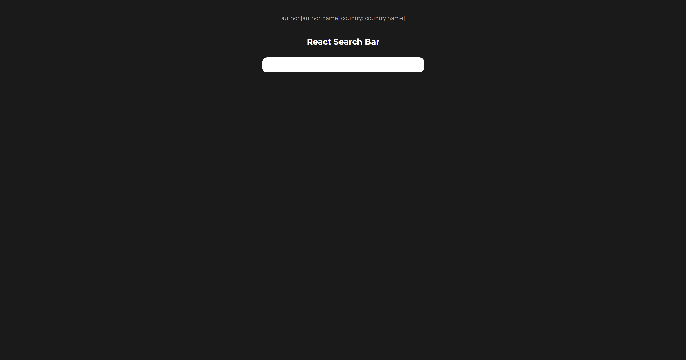

# Modern Hangman

Searching a website isnt always fun when you dont know what you are searching for. This search bar displays results as a user types as well as offers search operators to find exactly what the user is looking for.

## Table of contents

- [Overview](#overview)
  - [Description](#description)
  - [Screenshot](#screenshot)
  - [Links](#links)
- [My process](#my-process)
  - [Built with](#built-with)
  - [What I learned](#what-i-learned)
  - [Useful resources](#useful-resources)
- [Author](#author)

## Overview

### Description

This search bar displays data from a list of books that I was given. The user can search directly by typing into the search bar or they can use operators to find a specific book. For example typing "author:" before an authors name will filter the results based on that author. More operators and search terms to come.

### Screenshot

### Links

- Live Site URL: [https://aaron-soto.github.io/react-search/](https://aaron-soto.github.io/react-search/)

## My process

### Built with

- [React](https://reactjs.org/) - JS library
- SCSS with custom mixins and variables
- useState, useEffect hooks

### What I learned

This project relied pretty heavily on the javascript filter function as well as handeling user inputs.

### Useful resources

- [React Js Docs](https://reactjs.org/docs/hooks-reference.html) - I went straight to the source for this one and went through the react docs.

## Author

- Website - [Aaron Soto](https://aaronsoto.io)
- Github - [@aaron-soto](https://github.com/aaron-soto)
- Linkedin - [@aaron-soto1](https://www.linkedin.com/in/aaron-soto1/)
